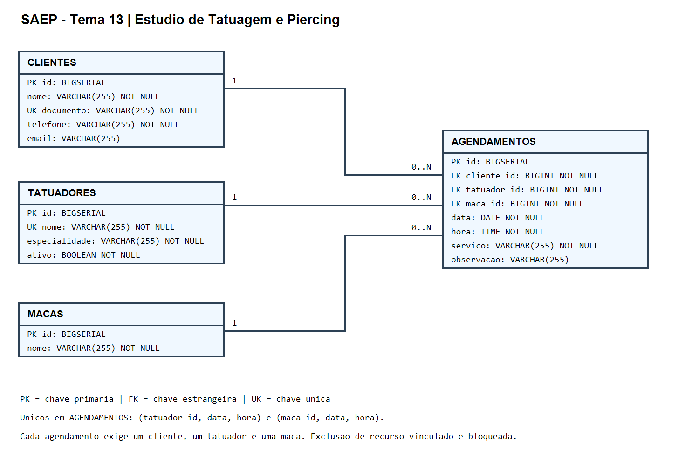

# SAEP — Estúdio de Tatuagem e Piercing

Sistema de agendamento do tema 13, com frontend Angular e API Java/Spring Boot. Permite gerenciar clientes e sessões de desenho, tatuagem e body piercing, impedindo a reserva da mesma maca ou do mesmo tatuador na mesma data e hora.

## Executar

### 1. Banco de dados

Com PostgreSQL instalado e iniciado, execute na raiz do projeto:

```powershell
psql -U postgres -d postgres -f banco/01_criar_banco.sql
psql -U postgres -d saep_agendamento_db -f banco/saep_agendamento_db.sql
```

No pgAdmin, execute o primeiro arquivo conectado ao banco `postgres`, com autocommit; abra outra consulta no banco `saep_agendamento_db` para executar o segundo. Os scripts são para instalação nova: não execute novamente em um banco já populado. São criados cinco tatuadores e cinco macas.

A conexão está em `backend/src/main/resources/application.properties`: porta 5432, usuário `postgres` e senha local `postgres`. Ajuste conforme sua instalação. A API usa `ddl-auto=validate`: confere a estrutura na inicialização e não tenta alterar silenciosamente o banco. O SQL entregue contém a estrutura completa.

### Banco já existente da versão anterior

Se a tabela `clientes` ainda tiver `cpf` no lugar de `documento` e `agendamentos` possuir `sala_id` e `procedimento_id`, execute:

```powershell
psql -U postgres -d saep_agendamento_db -v ON_ERROR_STOP=1 -f banco/02_atualizar_base_antiga.sql
```

Essa migração corrige a base antiga encontrada neste projeto, onde macas e tatuadores já existem. Preserva os clientes, renomeia `cpf` para `documento` e torna opcionais as referências antigas de sala/procedimento. As colunas legadas são mantidas para preservar dados; não são usadas pelo tema 13. O script pode ser reaplicado. Para uma instalação nova, use os dois scripts da seção anterior.

### 2. Backend

```powershell
cd backend
.\mvnw.cmd spring-boot:run
```

API: `http://localhost:8081/api`. Na primeira execução o Maven pode precisar baixar dependências.

### 3. Frontend

Em outro terminal:

```powershell
cd frontend
npm ci
npm start
```

Acesse `http://localhost:4200`. Use **admin / admin123**. A conta administrativa é fixa para esta entrega local. O login cria uma sessão HTTP no servidor; a API exige essa sessão e o logout a invalida. Sessões expiram após 30 minutos de inatividade. O nome armazenado no navegador serve à interface, não autoriza chamadas à API.

## Requisitos funcionais

| ID | Requisito |
|---|---|
| RF-01 | Autenticar o administrador e mostrar o motivo de falha no login. |
| RF-02 | Exibir o nome do usuário logado, logout e navegação para Clientes e Agendamentos. |
| RF-03 | Bloquear páginas internas e chamadas à API sem autenticação. |
| RF-04 | Cadastrar clientes com nome, documento e telefone obrigatórios e e-mail opcional. |
| RF-05 | Listar clientes consumindo a API e filtrar por nome ou documento. |
| RF-06 | Editar e excluir clientes; impedir documento duplicado e exclusão de cliente com agendamentos. |
| RF-07 | Mostrar visualmente os campos obrigatórios inválidos no cadastro de clientes. |
| RF-08 | Criar agendamento com cliente, tatuador, maca, data, hora e serviço obrigatórios; observação opcional. |
| RF-09 | Carregar os selects de clientes, tatuadores ativos e macas a partir da API/banco. |
| RF-10 | Bloquear na API reservas para o mesmo tatuador na mesma data e hora, inclusive na edição. |
| RF-11 | Bloquear na API reservas para a mesma maca na mesma data e hora, inclusive na edição. |
| RF-12 | Exibir no Angular o alerta recebido da API quando uma operação for bloqueada. |
| RF-13 | Listar o histórico com data, hora, cliente, tatuador, maca e serviço. |
| RF-14 | Editar e excluir agendamentos existentes. |
| RF-15 | Disponibilizar pelo menos cinco tatuadores e cinco macas via script SQL. |

A regra compara data e hora exatas, conforme o item 8.4 do enunciado. Não há duração ou horário final das sessões. O histórico lista os agendamentos persistidos; a exclusão remove o registro, conforme o CRUD solicitado.

## Diagrama entidade-relacionamento



Cada cliente, tatuador e maca pode estar associado a zero ou muitos agendamentos. Cada agendamento exige exatamente um cliente, um tatuador e uma maca. As chaves únicas `(tatuador_id, data, hora)` e `(maca_id, data, hora)` também impedem duplicação no banco.

O DER pode ser regenerado com `powershell -ExecutionPolicy Bypass -File docs/gerar-der.ps1` no Windows.

## API REST

| Método | Rota | Operação |
|---|---|---|
| POST | `/api/auth/login` | Login com `usuario` e `senha`. |
| POST | `/api/auth/logout` | Encerrar sessão. |
| GET | `/api/clientes?busca=texto` | Listar e buscar clientes. |
| POST | `/api/clientes` | Criar cliente. |
| PUT / DELETE | `/api/clientes/{id}` | Editar / excluir cliente. |
| GET | `/api/tatuadores` | Listar tatuadores ativos. |
| GET | `/api/macas` | Listar macas. |
| GET / POST | `/api/agendamentos` | Listar / criar agendamentos. |
| PUT / DELETE | `/api/agendamentos/{id}` | Editar / excluir agendamento. |

As chamadas autenticadas usam cookie de sessão. Erros retornam `message` para exibição na interface: 400 para dados inválidos, 401 para falta de autenticação, 404 para registro inexistente e 409 para conflitos. Não é necessário cadastrar recursos pela interface: sua população é feita pelo SQL.

## Infraestrutura

| Componente | Versão / configuração |
|---|---|
| Sistema operacional | Windows 11 |
| Node.js | 24.16.0 no ambiente de desenvolvimento |
| Angular | 22.1.x, conforme package.json e package-lock.json |
| TypeScript | 6.0.2 (faixa ~6.0.2) |
| Linguagem do backend | Java 21; JDK local 21.0.10 |
| Framework do backend | Spring Boot 4.1.1 |
| SGBD | PostgreSQL 18, porta 5432 |
| Banco de testes automatizados | H2 em memória, modo PostgreSQL |
| Portas da aplicação | Angular 4200; API 8081 |
| Ferramentas | Maven Wrapper, npm e navegador com JavaScript/cookies habilitados |

## Testes e entrega

[Casos de teste e resultados de validação](docs/casos-de-teste.md).

```powershell
# Na pasta backend
.\mvnw.cmd test
# Na pasta frontend
npm run build
```

Os testes usam H2 separado do banco da aplicação. A entrega inclui este README, o DER em PNG, os scripts SQL, backend, frontend e documentação de testes. O Anexo III não foi fornecido junto ao enunciado disponível; os conteúdos solicitados estão organizados aqui e nos casos de teste para transcrição caso o avaliador exija seu formulário.

Repositório configurado: https://github.com/GabrielQueiroz31/SAEP-SistemaDeTatuagem
